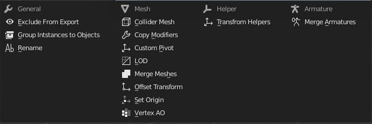
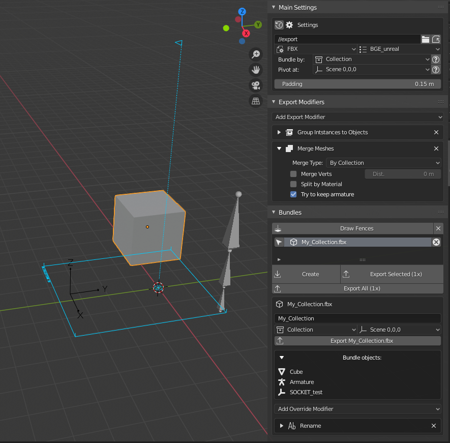
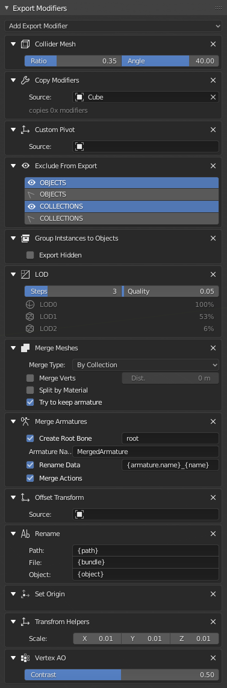

# Bundle Exporter

This project started as just a port of [**FBX Bundle**](https://bitbucket.org/renderhjs/blender-addon-fbx-bundle/src/master/) [(doc)](http://renderhjs.net/fbxbundle/) to **Blender 2.8** but it developped into much more. Here are some of the changes:

- Bundles are now saved in the scene and they don't require to have anything selected to see/modify/export them
- Added support for *empties*, *armatures* and *instanced collections* (this feature is enabled with a modifier)
- More flexible modifier system, it is much easier to create new modifiers
- Some new modifiers where added
- There are now two modifier stacks
    - Scene modifiers that are applied to all bundles when exported
    - Each bundle has its own "override modifiers"
- Modifiers are now grouped by categories (general, mesh, empties and amratures)
- Changed the way modifiers are displayed and chosen (similar to other blender modifiers)
- You can now save modifiers default settings in the addon preferences
- Instead of choosing a platform, now you choose a format and a preset (the original platforms are now included as presets)
- The export path is now automatically stored as a relative path
- Some features were removed (the unity script, the tools section...)

