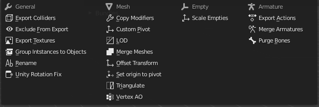

# Bundle Exporter

*This is a fork of [Bundle Exporter](https://gitlab.com/AquaticNightmare/bundle_exporter), updated to work with Blender 4.2+.*
[**FBX Bundle**](https://bitbucket.org/renderhjs/blender-addon-fbx-bundle/src/master/) [(doc)](http://renderhjs.net/fbxbundle/).

Bundle Exporter is a Blender addon to store export configuration in the Blender scene file. This allows you to setup relatively complex export rules, and export all objects from a file in a single batch operation. You can also add additional export-only modifiers like Triangulation, Custom Pivots, file remapping, and many more.

